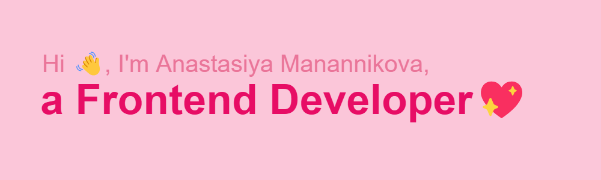

<!--## Hi there,  I'm Anastasiya! 👋

**nastushka-15/nastushka-15** is a ✨ _special_ ✨ repository because its `README.md` (this file) appears on your GitHub profile.

Here are some ideas to get you started:

- 🔭 I’m currently working on ...
- 🌱 I’m currently learning ...
- 👯 I’m looking to collaborate on ...
- 🤔 I’m looking for help with ...
- 💬 Ask me about ...
- 📫 How to reach me: ...
- 😄 Pronouns: ...
- ⚡ Fun fact: ...
-->

## I’m a passionate Frontend Developer💖
### I absolutely love coding – it’s not just a job for me, it’s a way to bring creativity and beauty into the digital world. 

___
 ### :hammer_and_wrench:Technology Stack:
 
 

   &nbsp
   &nbsp
   &nbsp
   &nbsp
   &nbsp
   &nbsp
   &nbsp
   &nbsp
   &nbsp
   &nbsp
    

    
### :page_with_curl:Contacts:
  

  
   

 

___
    
